# Readerview0 architecture

Readerview0 provides reusable reader application chrome and interaction in C. It composes UI0 controls around a host-owned document surface without parsing, paginating, rendering, or persisting documents.

## System boundary

```mermaid
flowchart LR
    App["Reader application"] --> RV["Readerview0"]
    RV --> UI["UI0"]
    UI --> Ground["Ground0"]
    App --> Engine["Document engine, such as Reader0"]
```

Readerview0 has no Reader0 dependency. An application projects document-engine state into Readerview0 and translates returned actions back into engine or application operations.

| Component | Owns |
| --- | --- |
| Readerview0 | Reader chrome, panel layout, transient interaction state, portable semantics, and requested actions |
| UI0 | Generic controls, layout, styling, and renderer-neutral drawing records |
| Document engine | Document parsing, content layout, pagination, search data, and navigation |
| Application | Workflows, persistence, native windows, rendering, accessibility adapters, and action execution |

## Build model

Each frame follows one bounded call:

1. The application supplies a `ReaderViewProjection`, input events, layout input, persistent `ReaderViewState`, and `ReaderViewFrameStorage`.
2. `reader_view_build` updates transient UI state and writes layout, drawing, text-binding, semantic, and action records into the supplied storage.
3. The application paints the document inside the returned content rectangle, presents the UI records, synchronizes native accessibility, and executes requested actions.

The projection describes what is true; actions describe what the user requested. Readerview0 never mutates an application database or document engine.

## Ownership and lifetime

- Projection pointers and strings are borrowed for one build.
- `ReaderViewState` and `ReaderViewFrameStorage` are caller-owned and fixed-capacity.
- Returned frame slices remain valid until that storage is used by the next build.
- Text metrics are borrowed, values-only records; no executable host callback crosses the package boundary.
- The package performs no hidden allocation, starts no threads, and uses no process-global mutable state.

Capacity failures and malformed required records fail explicitly rather than silently truncating a public contract.

## Layout and document surface

Readerview0 computes one coherent viewport, page-surface, and content geometry from the current chrome and panel state. The content rectangle is the application's authoritative target for document layout and painting.

The package owns the toolbar, progress controls, page gutters, contents and find surfaces, annotations surfaces, settings, popups, and note-editing chrome. It may reserve or overlay space for those elements, but it does not emit document-content drawing.

A trailing toolbar slot is reserved for host-owned behavior. Product-specific commands remain outside the package.

## Interaction and actions

Stable source keys keep projected rows and choices associated with their transient state across builds. Controls return keyed actions for operations such as navigation, search, selection, settings, annotations, and panel changes.

Readerview0 may keep bounded UI editing state, including a find query or note draft. Saving, deleting, searching a document, and changing persistent application state remain host operations. Host acknowledgements complete operations that need an explicit success or failure result.

## Focus and accessibility

Readerview0 owns portable focus identities, traversal order, modal containment, semantic roles, and semantic states. Pointer, keyboard, and native accessibility requests enter the same bounded interaction path.

The application owns native accessibility objects, platform event translation, announcements, and invocation. Native adapters should use semantic identities and source keys rather than localized labels.

## Dependency and package contract

Consumers include `code/readerview0.h` and compile `code/readerview0.c` exactly once. `code/readerview0_sources.manifest` is the authoritative source closure.

Readerview0 exact-pins UI0 and UI0's required Ground0 revision under `vendor/ui0_dependency/`. The package build verifies repository identity, commits, versions, API compatibility, manifests, and clean checkouts before running tests.

There is deliberately no direct Ground0 or Reader0 dependency.

## What does not belong here

- EPUB, PDF, or other format handling;
- document page or image rendering;
- application persistence and command routing;
- native window, renderer, or accessibility implementations;
- product-specific screens or policies;
- duplicate generic controls that belong in UI0.

Detailed acceptance evidence and dated implementation records are indexed in [`slices/README.md`](slices/README.md).
